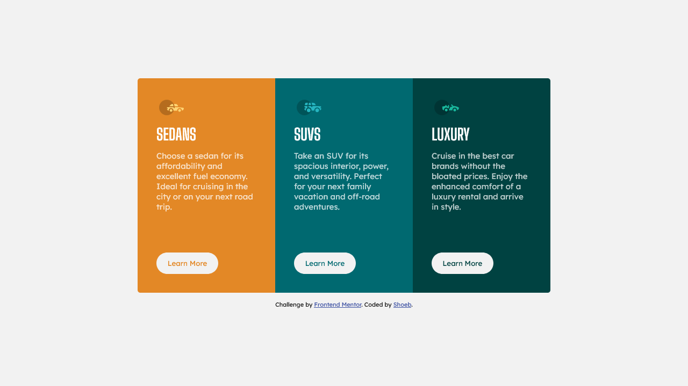

# Frontend Mentor - 3-column preview card component solution

This is a solution to the [3-column preview card component challenge on Frontend Mentor](https://www.frontendmentor.io/challenges/3column-preview-card-component-pH92eAR2-). Frontend Mentor challenges help you improve your coding skills by building realistic projects.

## Table of contents

- [Overview](#overview)
  - [The challenge](#the-challenge)
  - [Screenshot](#screenshot)
  - [Links](#links)
- [My process](#my-process)
  - [Built with](#built-with)
  - [Continued development](#continued-development)
- [Author](#author)
- [Acknowledgments](#acknowledgments)

## Overview

### The challenge

Users should be able to:

- View the optimal layout depending on their device's screen size
- See hover states for interactive elements

### Screenshot

Click on the above links to preview my solution of the challenge.
Alternatively, you can use a tool like [FireShot](https://getfireshot.com/) to take the screenshot. FireShot has a free option, so you don't need to purchase it.

### Links

- Solution URL:(https://github.com/shoebilyas123/FrontendMentor-Challenges/edit/ShoebIlyas-Master/3-column-preview-card-component-main)
- Live Site URL:(https://shoebilyas123-challenge1.netlify.app/)

## My process

-Used grid and flex to create 3-column card-component preview.

### Built with

- Semantic HTML5 markup
- CSS custom properties
- Flexbox
- CSS Grid
- Mobile-first workflow(i.e, Media Queries)

### Continued development

Shall continue to focus and improve upon Media Queries and and CSS grid.

## Author

- Frontend Mentor - [@shoebilyas123](https://www.frontendmentor.io/profile/shoebilyas123)
- Twitter - [@ShoebIlyas3](https://www.twitter.com/ShoebIlyas3)

## Acknowledgments

Special thanks to Front-end Mentor for providing such great challenges for beginner web-devs to improve upon their development skills.
