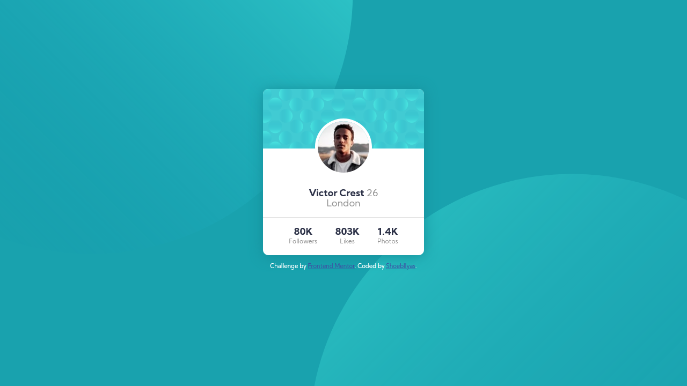
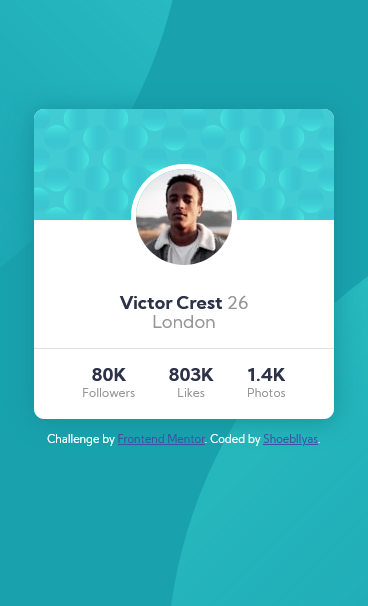

# Frontend Mentor - Profile card component solution

This is a solution to the [Profile card component challenge on Frontend Mentor](https://www.frontendmentor.io/challenges/profile-card-component-cfArpWshJ). Frontend Mentor challenges help you improve your coding skills by building realistic projects.

## Table of contents

- [Overview](#overview)
  - [The challenge](#the-challenge)
  - [Screenshot](#screenshot)
  - [Links](#links)
- [My process](#my-process)
  - [Built with](#built-with)
- [Acknowledgments](#acknowledgments)
## Overview

### The challenge

- Build out the project to the designs provided

### Screenshot

**Note: Delete this note and the paragraphs above when you add your screenshot. If you prefer not to add a screenshot, feel free to remove this entire section.**

### Links

- Solution URL: [GitHub Solution Page](https://github.com/shoebilyas123/FrontendMentor-Challenges/tree/ShoebIlyas-Master/profile-card-component-main)
- Live Site URL: [Netlify Live Site](https://shoebilyas123-ch2.netlify.com)

## My process

### Built with

- Semantic HTML5 markup
- CSS custom properties
- Flexbox
- CSS Grid

## Author

- Frontend Mentor - [@shoebilyas123](https://www.frontendmentor.io/profile/shoebilyas123)
- Twitter - [@shoebilyas3](https://www.twitter.com/yourusername)

## Acknowledgments
Thanks to frontendmentor.io for providing with this greate challenge! This really helps us to level up our web-dev skills.
